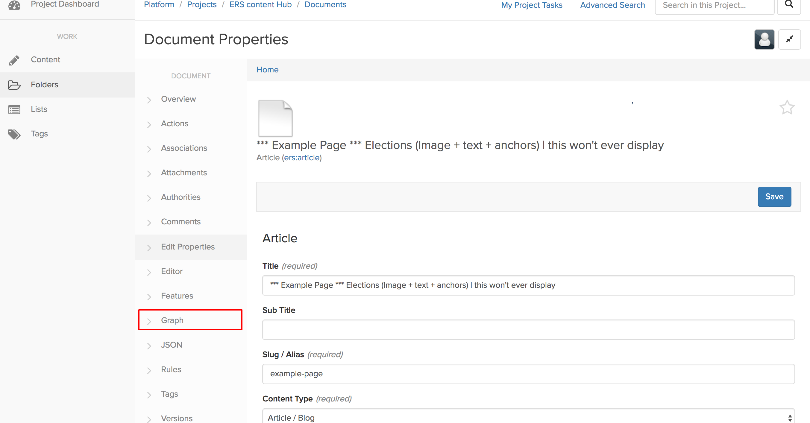
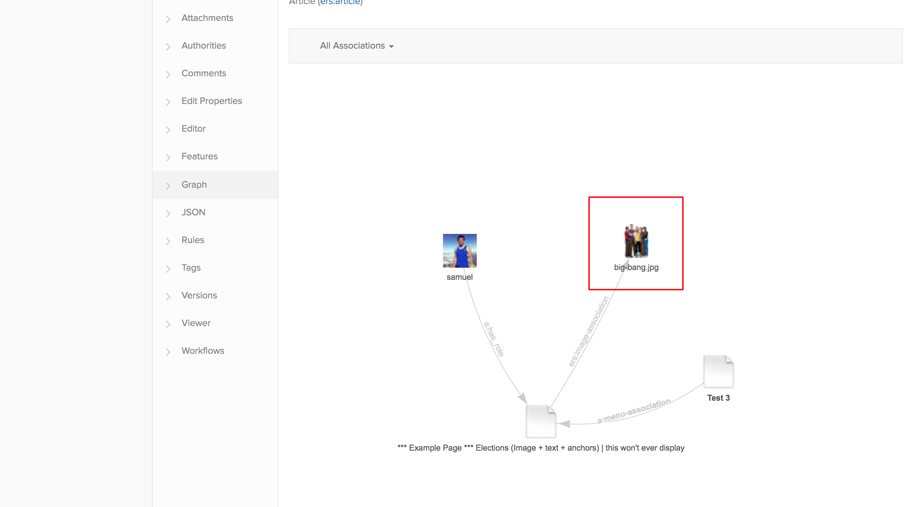
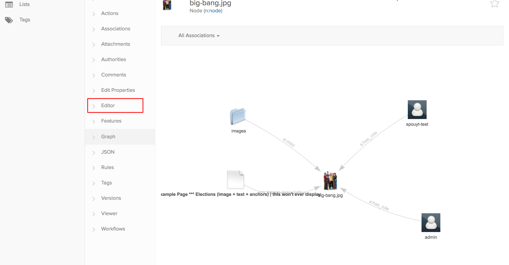
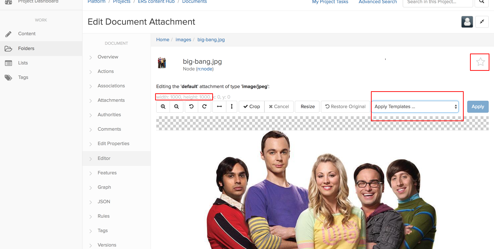
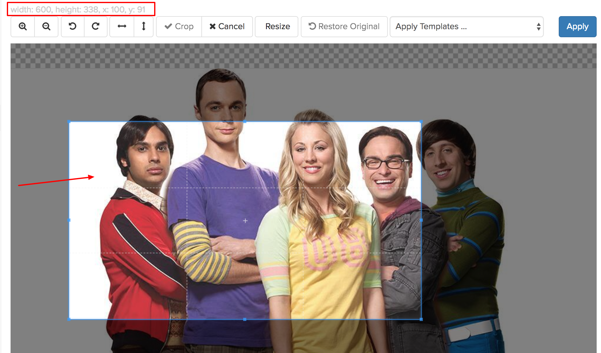
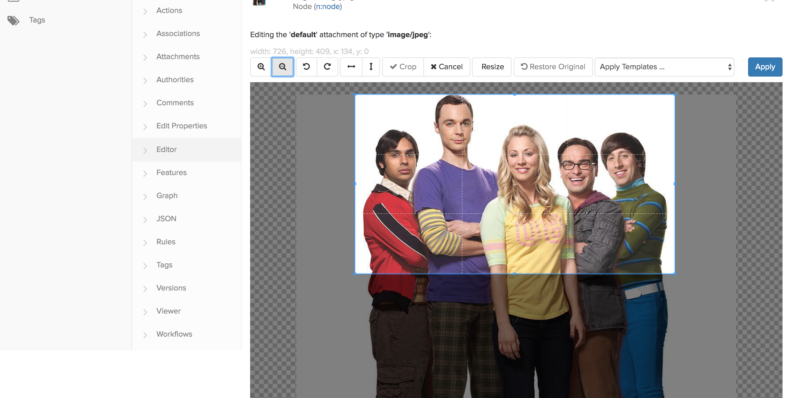
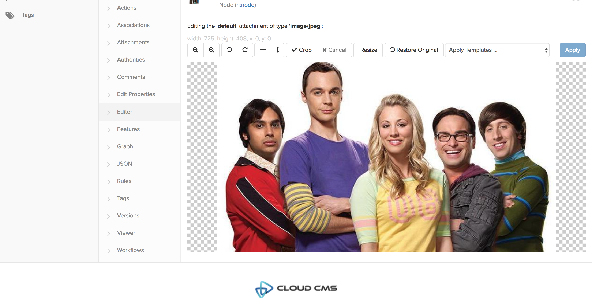

# Edit an Image on Cloud CMS
The other new feature is photo editing. Unfortunately, right now it cannot be done from the article you are editing but let see step by step how to do that. I have opened an article and uploaded the following picture:


The resolution is good. But it is a square of 1000x1000px it is not really suitable for the website nor the app. As the best way to display images on all devices is images in portrait mode.


In order to make the above image usable, let's edit it directly from Cloud CMS.
 
1. Upload a picture that you want with the image field on the edit form. Then save the article, so that the image were linked to the article. If you forget, the picture __has been uploaded__, so do not try to upload it again, find it and select with the select existing image button.
2. When the article is saved, click on the graph button



3. This will open the graph view that let you see the connected elements to an article.

As author of the article, my user is linked to the article as well as the Big Bang image. Clinking on the image,  will make you navigate to the graph view __of the image__.



The view has indeed changed, and that the example page is still connected to the image, but we can also see the folder in which the image is and the user `spouyt-test` who actually uploaded the image.
Now click on the Editor button highlighted in red.



4. Let’s have a look at the editor:



You can see many things and do not be afraid to try them out as you can cancel your changes, and if you have applied your changes, you can still go back (`restore original` button)
There are two templates that have correct proportions: 16:9 for general images use the medium one, for big images as the one used on the homepage use the large template.
When you apply the medium template, you see this:



The size has changed (red box) and represents the size of the blue box. You can move this box around by clicking/moving it. You will also need to use the `+` and `–` signs to zoom/un-zoom the image to make the subject in the blue box:



5. When you are happy with your changes you can apply them



After applying, your changes __are saved__, and you can go back to editing your article using the graph. 

Remember that if you work with some content items often you can “favorite them” with the star highlighted above (Editor image).

Positioniong images with the position fileds in the CMS will soon be deprecated and removed from the form, therefore this will be then only option to edit images.

If you want to edit many images, you can directly go to the image folder that is located here.

```
    Folders > images 
```

find your images and edit them.
 