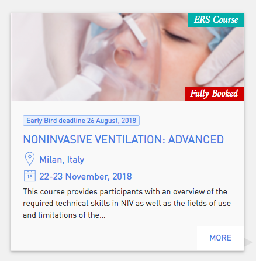
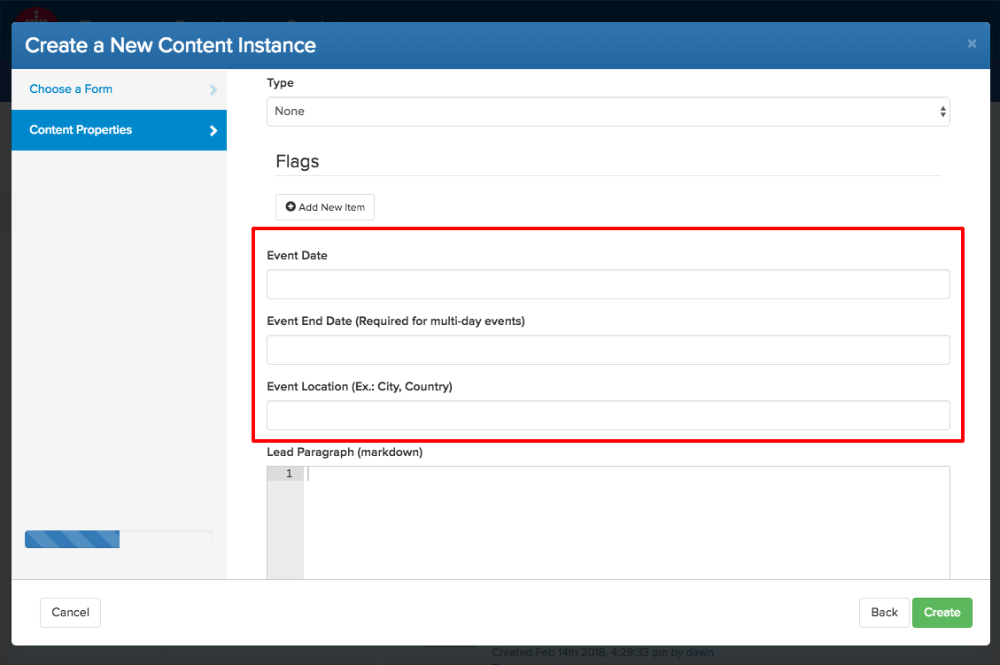
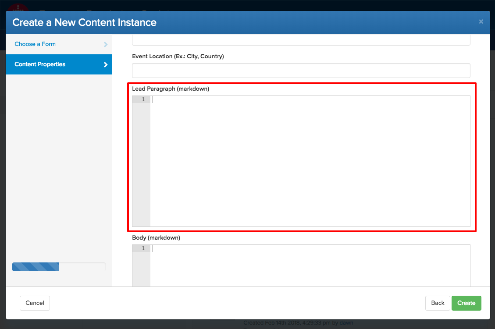
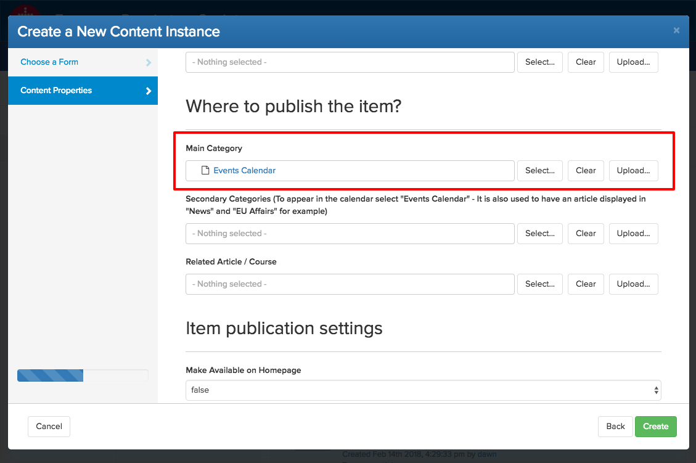
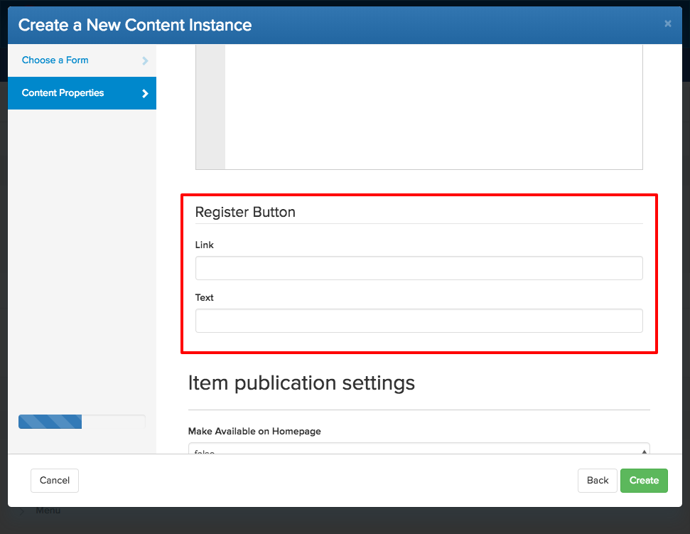
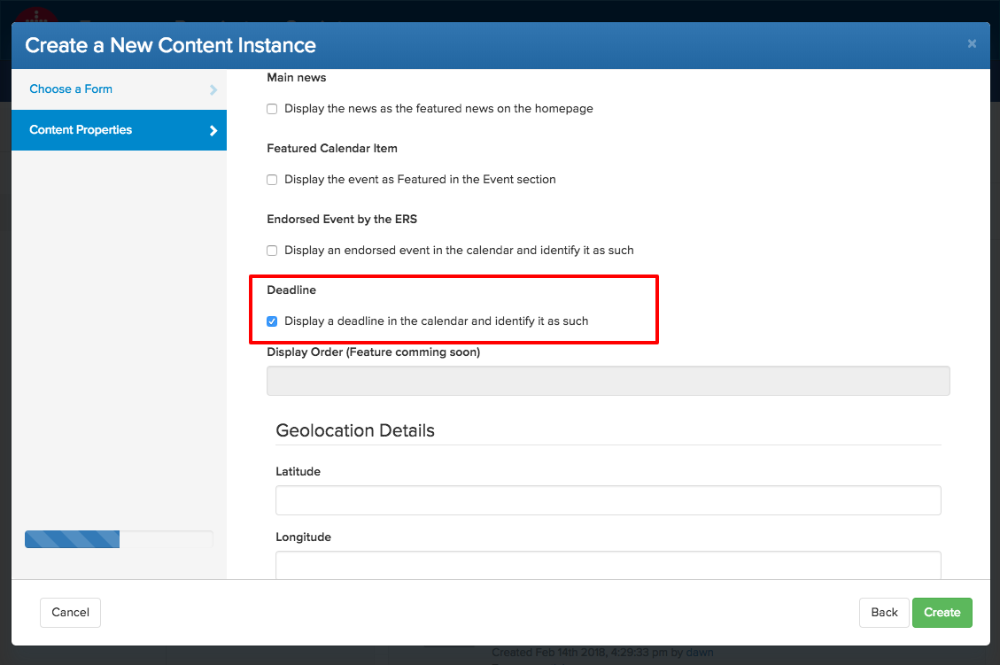

# ERS Events Calendar

The ERS Events Calendar allows to post different types of events :
 
1. __ERS Events__: promoting our events with all possible features in display (image, early-bird deadlines, live streaming info, etc)

    
2. __ERS Deadline__:  activities requesting an action (e.g. Abstract Submission… deadline, Congress Registration Early bird… deadline, Fellowships, Research seminars etc.)
3. __Endorsed events__: these events are “second class” events, they still have a good visibility as the ERS endorses them.
4. __Non ERS Events__: these are “third class” events. You will only be able to display the title of the event, dates, location and a link (no specific visual).

## How to publish an event into the calendar

Procedure: How to publish your item in the calendar
 
1. __Login__ in [Cloud CMS](https://ers.cloudcms.net).
2. __Navigate to `Content`__ and [create a new](/cloud-cms/create-or-edit-an-article.html#create) item or modify an existing one by [editing it](/cloud-cms/create-or-edit-an-article.html#edit)
3. Select the content type. For ERS events, select the specific content type (such as Course, Fellowship, EBUS, Seminar), and the general “Calendar item”, for non ERS events and Deadlines.
    Calendar Items will __only__ appear in the calendar section of the website.
    The type property can be chosen to precise which conentent type _e.g._ Course is the content type “On-line Course” is the “type” of the “content type”. These are displayed in what we call a “flag” on the top right of the image.
    
 
4. __Start Date__: An  event needs to have at least a start date, if it has only a start date it is considered as a one day event. The end date is not necessary in this case. If it is a multi-days event add an end date.
5. __Event Location__: is as free text field. For consistency use the following format “City, Country”. Maps are generated based on the Venue adress not this text field
    
 
6. __The Lead Paragraph__ is used to display text under the title. The format is markdown.
    
 
7. __Categories__:  An Event needs to be put in the category Event Calendar either as the __Main Category__ (Non ERS, Deadline) or in the __Secondary Categories__ section. A course would have `ERS Courses` as the main category and would have `Events Calendar` as secondary category and any additional category that is necessary.
    
 
8. __Register button__: To dispaly a register button just paste in the full url of the event website or webpage
If you want to put an email, just add `mailto:` in front of it `mailto:samuel.pouyt@ersnet.org` the button will open the mail client. If you want to change the text of the button add it in the field text. Remember, it is a button, it should be small text such as `Apply`, `Register`, `Submit`, etc. The text is automatically formatted so you do not need to use caps.
    
 
9. Last information to enter: if the course is a `deadline`, a `non-ERS event` or an `endorsed event`, we need to tell the system. This is very important as it insure we are conform with what the leadership wants. It is simple, just tick the corresponding tick box:
    
    The option might not be available as the form adapts to what has been selected. At least for now an EBUS course cannot be a non ERS event, therefore that option is not available.