# Notifications
It is now possible to send push notifications to the ERS Connect app. 
Only certain users of the CMS can send notifications. You can request "notifications rights" by contacting the IT department.

Notifications can be found under `content -> notifications`
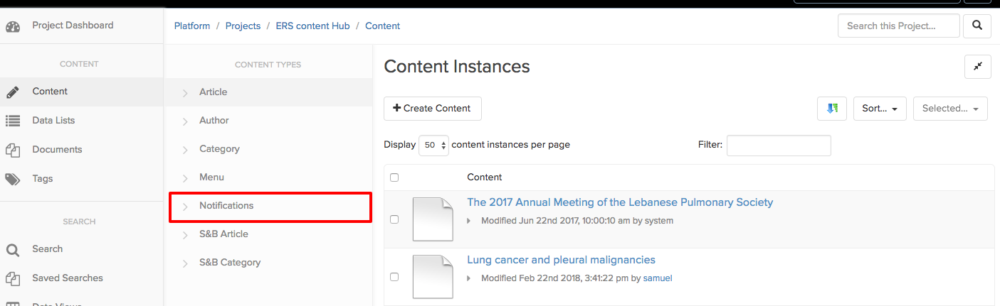
 
## Create a notification

Notifications can be created as with any other content type by clicking on Create Content
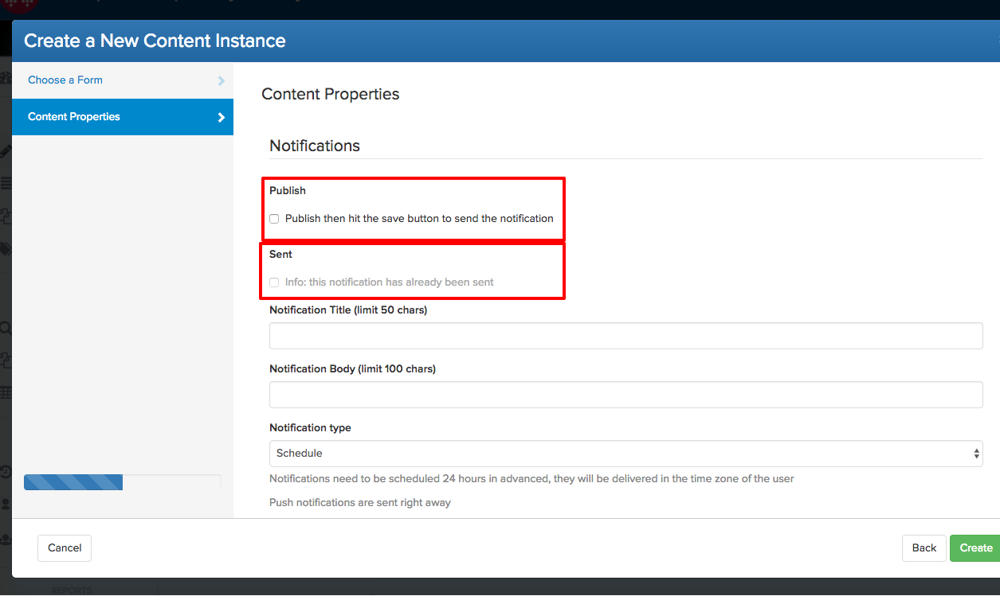

Fill in the form as you would for an article (details of the field below). Note that the notification will __not be sent__ when you click on the create button. The reason is to prevent sending inadvertently notifications. Therefore, when the notification has been created, open it, review it and make sure everything is as you intended, change the setting of the publish tick box and save the notification. Saving the notification associated with the publish tick box, sends/schedules it.

## Publish / Sent

When the notification is created it is a draft, nothing is sent until the notification is changed (updated by saving it again) and the `publish` tick box is checked. The workflow is to leave `publish` unchecked, fill in the form and hit create. Then open the created notification, review it and make sure there is no mistake, then check the `publish` tick box and save the content item. The action of saving the content item with the `publish` check box `checked` triggers the notification. There is no way back. (more on this later)

The `sent` property is a “system” property and it will prevent sending the same notification twice. It cannot be changed, and it is updated when the notification has been successfully sent.

Let’s now see all the options:
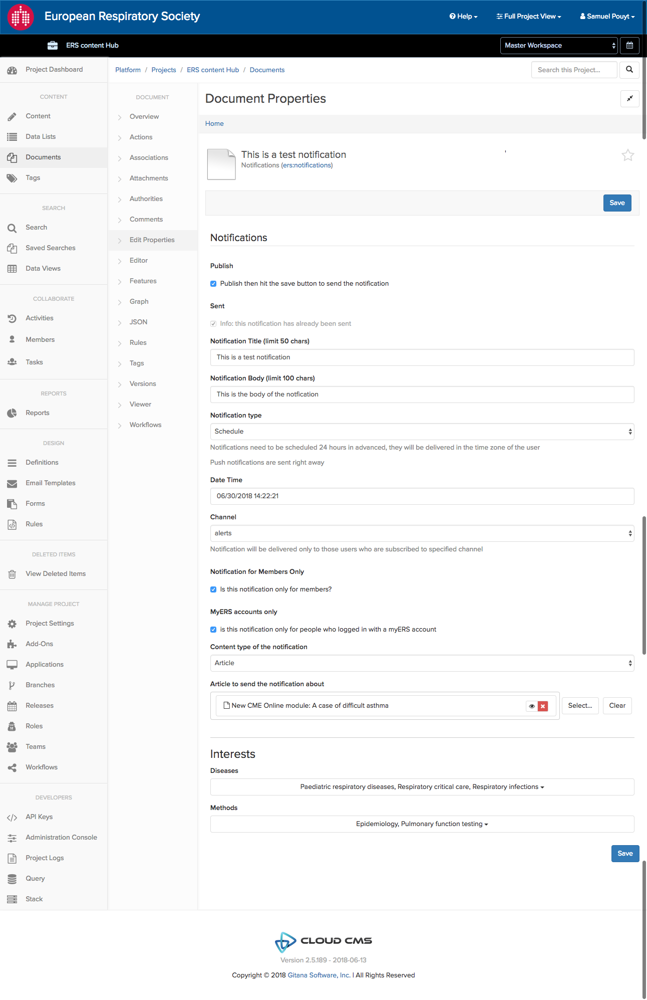
 
This is a notification that has already be sent (the `sent` checkbox is checked)

## Title / Body

The title and the body are displayed as follow:
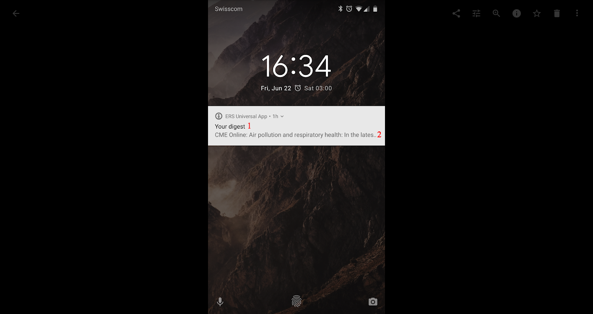 
* (1) Title
* (2) Body
The `title` is limited to `50` characters and the `body` to `100`.  The spotme icon will be changed to an ERS one in an upcoming build.

## Notification Type

There are two types to choose from `push` and `schedule`. Push notification are sent right away, to everyone who matches (see below). There is no way back for push notifications when the `publish` tick box is checked and you save the content item the notification is sent.

You can schedule notification, they will be sent to the users in __their time zone__, in order for the scheduling to work, notification need to be scheduled __at least 24 hours in advance__. Scheduled notification can be cancelled, for now there is no integrated way of doing this, but you can send me the `id` (see below) of the notification and I will cancel it manually.

If the `schedule` option is selected a date/time fields appears with a picker when you click on it. You can select the date, then by clicking on the clock icon at the bottom of the calendar, select the time of the notification:
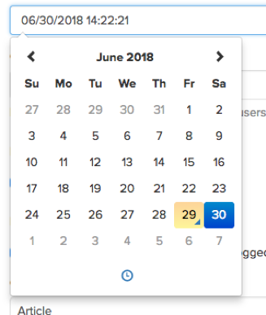 

## Channels

There are, for now 5 channels:
1.	Alerts
2.	ERS events
3.	ERS highlights
4.	ERS news
5.	ERS vision

Channels are ways to let our user subscribe to notification topics that might interest them. If a user has deactivated in the setting of the app ERS events and you send a notification to ERS events, that person will not receive it.

Alerts are considered “general notifications” the other speak for themselves. If we need another channel, it can be added at any time.

## ERS Members and myErs accounts
These options will limit the notification to ERS Members and/or app users logged in with a myERS account. If you select only Members Only and myERS accounts Only, both groups will receive the notification, but it does not really make sense as Members are included in myERS accounts holder. It is interesting to use for members only or for myERS account holders. 

Using these checkboxes with interests (see below) will limit each of the selected interest to ERS members or myERS account holders.

## Content types
There are two types: `Article` and `Link`. `Article` will let you choose an article from the CMS, the article will open natively in the app as any other content.

`Link` on the other hand, will let you paste/type any full URL including http or https protocol. These will open in the app as a Webview (stripped down browser in the app) inside the app. Therefore, you can link to any website and it will open inside the app. It can be interesting to share journal articles, CME online modules, or any other content. 

## Interests
These options will target user by interests (Diseases and Methods). Select any of them and all people that have one interest that match will be targeted. Consider this selection as an OR. If you select ERS members and a few interests, then it will limit each interest to ERS members (same thing for myERS account holders)

The following schema describes what has been described above as ensembles: 
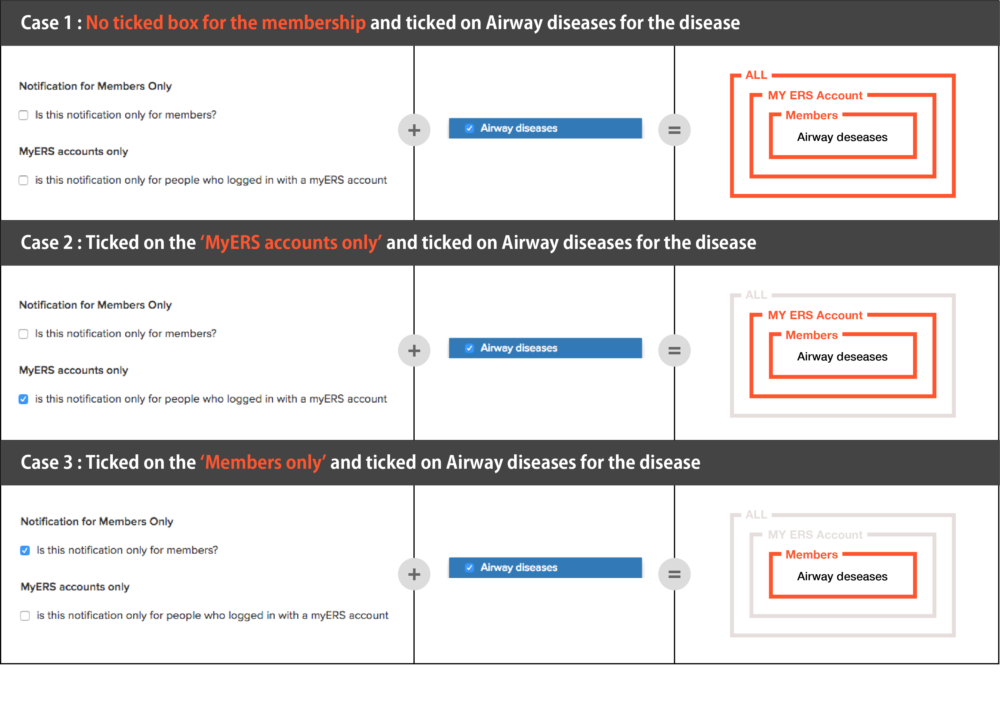 

Examples: 
`Airway disesase` OR `Thoracic Oncology`. 
`Airway disesase`  AND `ERS member` OR `Thoracic Oncology` AND `ERS Member`.

After sending a notification, you will have some feedback in the comment section of the content item:

1)	Click on Overview and 
2)	Scroll down to the comments
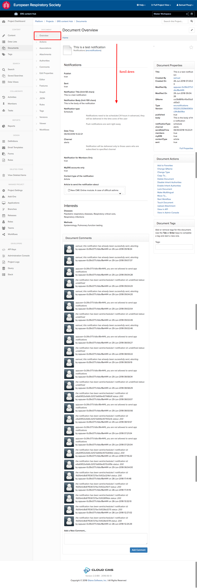 

There you will find different comments:

1. Everything went well:

    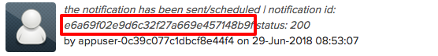 

    The string in the red box is the id that I would need to cancel the scheduled notification
2. Not allowed

    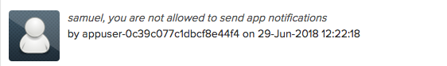 

The user name of the person who attempted to send a notification will be written in the comment box
3. Attempting to re send a notification will trigger this comment:

    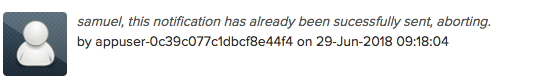

4. I there are any other error, they will also be printed in comments, please let me know if something happens.

::: tip
Note that I have changed the icon for the sake of clarity. Comments written by the API now look like this:

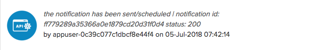 
:::

Allowed users
The following users can send notifications (new user can be added)
1.	Dawn
2.	Beth
3.	Tamaki
4.	Stéphane
5.	Samuel

The main users of this feature should be Dawn and Beth, we are in this list to cover for vacation and/or unavailability of someone from the communication team.

### TODOS
* [ ] Implement cancellation from CMS
* [ ] If needed implement more filtering options and conditional rules
* [ ] For now, we can send programmatically notifications to ERS IDs this is potentially very interesting as we can target people when their membership expires, when they have a new certificate, when their abstracts are accepted and so on. I could also add this to the UI. There is a small complexity, we need to know if the user has the app installed or not. (We have the info, we just need to find a way to share, maybe add to the CRM)
